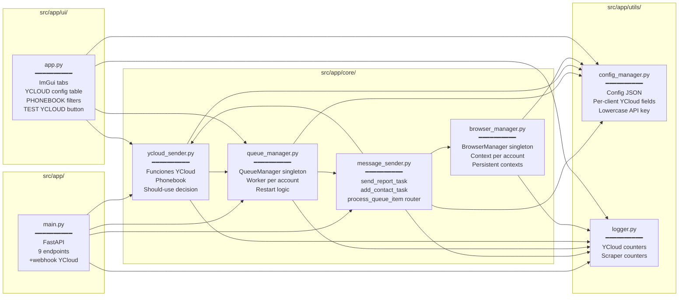
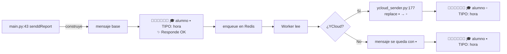
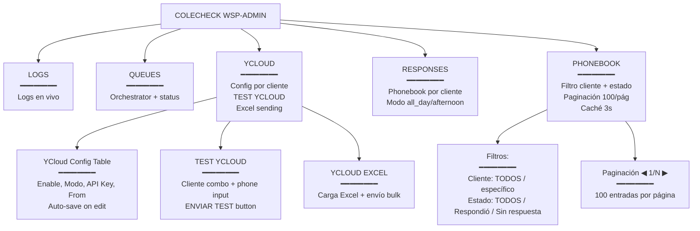
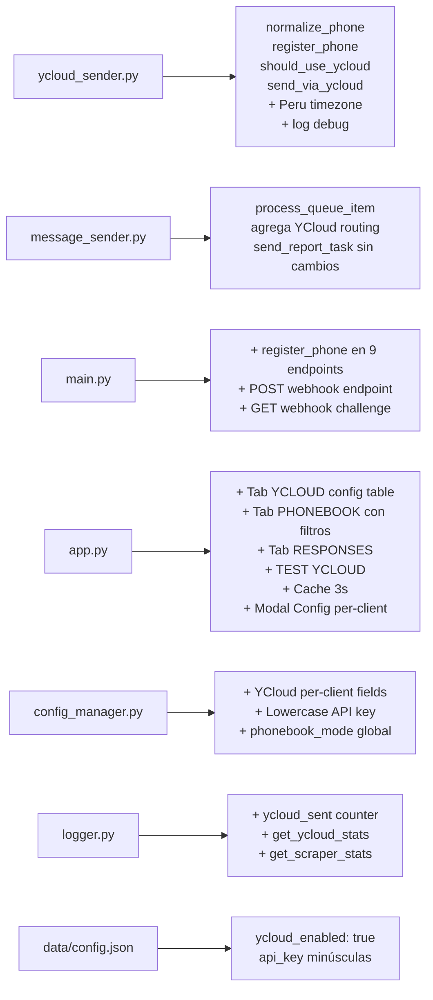

# WSP Admin — Estado del Proyecto al 2026-06-03

## Branch: `wsp-hybrid`

Documento para preservar contexto entre sesiones. Contiene el estado completo del proyecto, los cambios recientes, los bugs encontrados y sus soluciones.

---

## Diagrama de Arquitectura

```mermaid
graph TB
    subgraph Cliente[API Externa]
        POST[POST /senddReport]
    end

    subgraph FastAPI[main.py :3000]
        WH[POST /webhook YCloud]
        API1[senddReport]
        API2[addNumber]
        API3[sendWelcomeMessage]
        API4[sendRegistrationLink]
        API5[sendCredentials]
        API6[sendwReport]
        API7[sendAgenda]
        API8[sendComunicado]
        API9[sendWarning]
    end

    subgraph Redis[(Redis :6379)]
        Q[queue:{account} - List]
        PB[phonebook:{account} - Set]
        PBMETA[phonebook:meta:{account} - Hash]
        PBREV[phonebook:reverse - Hash]
        RESP[response:{phone} - String TTL 86400s]
        YC[ycloud:responded - Set]
        YCP[ycloud:responded:{account} - Set]
    end

    subgraph Workers[Workers asyncio - 1 por cliente]
        W1[worker ie-rafael]
        W2[worker ie-manuel]
        W3[worker borrar]
        W4[worker ie-leon]
        W5[worker ie-rafael-2]
    end

    subgraph Router[process_queue_item]
        DEC{¿should_use_ycloud?}
    end

    subgraph YC[YCloud API]
        YCAPI[api.ycloud.com/v2/whatsapp/messages/sendDirectly]
    end

    subgraph Playwright[Browser Manager]
        C1[Context ie-rafael]
        C2[Context ie-manuel]
        C3[Context borrar]
        C4[Context ie-leon]
        C5[Context ie-rafael-2]
    end

    subgraph WW[web.whatsapp.com]
        WA[WhatsApp ie-rafael]
        WB[WhatsApp ie-manuel]
        WC[WhatsApp borrar]
        WD[WhatsApp ie-leon]
        WE[WhatsApp ie-rafael-2]
    end

    POST --> API1
    WH --> RESP
    WH --> YC
    WH --> YCP

    API1 -->|background_tasks| REG[register_phone]
    API2 -->|background_tasks| REG
    API3 -->|background_tasks| REG
    API4 -->|background_tasks| REG
    API5 -->|background_tasks| REG
    API6 -->|background_tasks| REG
    API7 -->|background_tasks| REG
    API8 -->|background_tasks| REG
    API9 -->|background_tasks| REG

    REG --> PB
    REG --> PBMETA
    REG --> PBREV

    API1 --> ENQ1[enqueue]
    API2 --> ENQ2[enqueue]
    API3 --> ENQ3[enqueue]
    API4 --> ENQ4[enqueue]
    API5 --> ENQ5[enqueue]
    API6 --> ENQ6[enqueue]
    API7 --> ENQ7[enqueue]
    API8 --> ENQ8[enqueue]
    API9 --> ENQ9[enqueue]

    ENQ1 --> Q
    ENQ2 --> Q
    ENQ3 --> Q
    ENQ4 --> Q
    ENQ5 --> Q
    ENQ6 --> Q
    ENQ7 --> Q
    ENQ8 --> Q
    ENQ9 --> Q

    Q --> W1
    Q --> W2
    Q --> W3
    Q --> W4
    Q --> W5

    W1 --> DEC
    W2 --> DEC
    W3 --> DEC
    W4 --> DEC
    W5 --> DEC

    DEC -->|Sí| SENDYC[send_via_ycloud]
    DEC -->|No| SENDP[send_report_task]

    SENDYC --> YCAPI
    SENDP --> C1
    SENDP --> C2
    SENDP --> C3
    SENDP --> C4
    SENDP --> C5

    C1 --> WA
    C2 --> WB
    C3 --> WC
    C4 --> WD
    C5 --> WE
```

---

## Diagrama de Archivos



---

## Diagrama del Sistema Híbrido YCloud + Scraper

```mermaid
flowchart TD
    START([Mensaje nuevo llega al API]) --> ENQ[enqueue: agrega a queue:{account}]
    ENQ --> WK[Worker lee con blpop]

    WK --> PQI[process_queue_item]
    PQI --> DEC1{¿ycloud_enabled?}

    DEC1 -->|No| SCRAPER[send_report_task → Playwright]
    DEC1 -->|Sí| DEC2{¿Modo?}

    DEC2 -->|solo_scraper| SCRAPER
    DEC2 -->|solo_ycloud| YC[send_via_ycloud]
    DEC2 -->|hibrido| DEC3{¿response:{phone} existe?}

    DEC3 -->|No| SCRAPER
    DEC3 -->|Sí| YC

    YC --> RES{¿status 200/202?}
    RES -->|Sí| DONE([✅ Enviado])
    RES -->|No| WARN[WARN: YCloud falló, usando scraper]
    WARN --> SCRAPER

    SCRAPER --> PW[Playwright: search + typing + send]
    PW --> DONE2([✅ Enviado])

    WH[Webhook: whatsapp.inbound_message.received] --> STORE[store_response: set response:{phone} TTL 86400s]
    STORE --> UPD[Update ycloud:responded sets]
```

---

## Estructura del Mensaje



**Distinción visual:**
- **YCloud**: `▫️` (cuadrado blanco pequeño)
- **Scraper**: `▪️` (cuadrado negro pequeño, mismo tamaño)

---

## Redis Keys

```mermaid
graph TB
    subgraph Claves[Redis Keys]
        K1[queue:{account}<br/>━━━━━━━━<br/>Type: List<br/>TTL: -]
        K2[phonebook:{account}<br/>━━━━━━━━<br/>Type: Set<br/>TTL: -<br/>5000+ items OK]
        K3[phonebook:meta:{account}<br/>━━━━━━━━<br/>Type: Hash<br/>phone → first_seen ISO]
        K4[phonebook:reverse<br/>━━━━━━━━<br/>Type: Hash<br/>phone → account]
        K5[response:{phone}<br/>━━━━━━━━<br/>Type: String<br/>TTL: 86400s 24h]
        K6[ycloud:responded<br/>━━━━━━━━<br/>Type: Set<br/>todos]
        K7[ycloud:responded:{account}<br/>━━━━━━━━<br/>Type: Set<br/>por cliente]
    end
```

---

## Tabs de la UI



---

## Bugs Críticos Encontrados y Resueltos

```mermaid
graph TB
    BUG1[BUG 1: datetime UnboundLocalError<br/>━━━━━━━━━━<br/>register_phone tenía<br/>from datetime import datetime<br/>dentro de if mode==afternoon_only<br/>PERO se usaba datetime.now PERU_TZ<br/>en código posterior sin guardar
    FIX 1[ycloud_sender.py:64-68<br/>━━━━━━━━━━<br/>Removido import local<br/>Usa el import del módulo]
    BUG1 --> FIX1

    BUG2[BUG 2: API key case-sensitive<br/>━━━━━━━━━━<br/>YCloud rechazaba<br/>72482E46... mayúsculas<br/>Funcionaba con 72482e46... minúsculas<br/>Porque YCloud es case-sensitive
    FIX 2[config_manager.py:84-86<br/>━━━━━━━━━━<br/>set_client_config aplica<br/>.strip().lower()<br/>automáticamente
    BUG2 --> FIX2

    BUG3[BUG 3: Phone sin prefijo 51<br/>━━━━━━━━━━<br/>to_phone = +940740243<br/>YCloud: 401 INVALID<br/>Debía ser +51940740243
    FIX 3[ycloud_sender.py:171<br/>━━━━━━━━━━<br/>to_phone = + normalize_phone phone<br/>normalize_phone agrega 51
    BUG3 --> FIX3

    BUG4[BUG 4: ycloud_enabled false<br/>━━━━━━━━━━<br/>Config tenía false<br/>Get_ycloud_mode retornaba<br/>solo_scraper siempre
    FIX 4[data/config.json:32<br/>━━━━━━━━━━<br/>Cambiado a true<br/>Usuario debe guardar cambios
    BUG4 --> FIX4

    BUG5[BUG 5: Retraso 1 hora<br/>━━━━━━━━━━<br/>5 workers competían<br/>wait_for_selector 60s timeout<br/>Workers morían silenciosamente
    FIX 5[queue_manager.py + message_sender.py<br/>━━━━━━━━━━<br/>wait_for_selector 20s<br/>Auto-restart workers<br/>Lock per account<br/>Logging mensajes lentos >30s
    BUG5 --> FIX5

    BUG6[BUG 6: Performance UI<br/>━━━━━━━━━━<br/>PHONEBOOK tab lento con 1500+<br/>Redis calls síncronas por frame
    FIX 6[ui/app.py update_data<br/>━━━━━━━━━━<br/>Cache _pb_cache y _yc_stats<br/>actualiza cada 3s en background<br/>UI lee de cache instantáneo
    BUG6 --> FIX6
```

---

## Archivos Modificados en esta Sesión



---

## Comandos Git

```bash
# Estado actual
git branch  # wsp-hybrid
git status  # modified: src/app/* + README.md + opencode.md

# Commit
git add README.md opencode.md src/app/core/ycloud_sender.py webhook.py \
       src/app/core/message_sender.py src/app/main.py src/app/ui/app.py \
       src/app/utils/config_manager.py src/app/utils/logger.py
git commit -m "feat: YCloud híbrido + phonebook por cliente + auto-save config"
git push origin wsp-hybrid
```

---

## Variables de Configuración

### Por cliente (data/config.json → clients.{name})

| Key | Default | Descripción |
|-----|---------|-------------|
| `ycloud_enabled` | false | Activar YCloud |
| `ycloud_mode` | "hibrido" | solo_scraper / hibrido / solo_ycloud |
| `ycloud_api_key` | "" | API key (hereda global si vacío, lowercase) |
| `ycloud_from` | "" | Número desde (hereda global si vacío) |
| `ycloud_url` | "" | URL API (hereda global si vacío) |
| `headless` | true | Browser visible/hidden |
| `override_welcome` | false | Override welcome message |
| `override_min_delay` | null | Min delay entre mensajes (0 = global) |
| `override_max_delay` | null | Max delay entre mensajes |
| `override_batch_size` | null | Mensajes por lote (0 = global) |
| `override_batch_pause` | null | Pausa entre lotes |

### Global (data/config.json → global)

| Key | Default | Descripción |
|-----|---------|-------------|
| `ycloud_api_key` | "" | API key global |
| `ycloud_from` | "+51963828458" | Número desde global |
| `ycloud_url` | "https://api.ycloud.com/v2/whatsapp/messages/sendDirectly" | URL API |
| `phonebook_mode` | "all_day" | all_day / afternoon_only |
| `send_mode` | "typing" | typing / paste |
| `batch_size` | 20 | Mensajes por lote |
| `batch_pause` | 60 | Pausa entre lotes (s) |
| `min_delay` | 2 | Min delay (s) |
| `max_delay` | 5 | Max delay (s) |
| `search_delay` | 2.0 | Espera post-typing (s) |
| `pre_send_min` | 1.0 | Espera pre-send min (s) |
| `pre_send_max` | 3.0 | Espera pre-send max (s) |

---

## Reglas Críticas para la Próxima Sesión

1. **API key en minúsculas SIEMPRE** — YCloud es case-sensitive, .strip().lower() en set_client_config y en el modal global.

2. **Phone debe tener formato +519XXXXXXXX** — normalize_phone agrega 51 si falta. send_via_ycloud usa "+" + normalize_phone.

3. **Redis con AOF persistencia** — Docker volumen anty_wsp_redis_data. Soporta 5000+ teléfonos por cliente.

4. **Worker auto-reinicia si muere** — el código ahora maneja esto, pero si un worker se queda colgado, el botón "SYNC & RESUME ALL" fuerza restart.

5. **No cambiar send_report_task** — la función Playwright scraper es la columna vertebral del fallback. Solo añadir routing en process_queue_item.

6. **El buffer de YCLOUD ya NO existe** — auto-save on change. Si cambias la config, se guarda inmediatamente en config.json.

7. **Hora en Peru (UTC-5)** — first_seen se guarda como `YYYY-MM-DDTHH:MM:SS.mmm`. Display muestra `MM-DD HH:MM`.

8. **No usar `from datetime import datetime` dentro de un if** — causa UnboundLocalError. Usar el import del módulo.

9. **Respuesta webhook con thumbs-up o texto** se guarda como response:{phone} con TTL 24h. Si YCloud está en modo híbrido, los respondedores van por YCloud.

10. **Diferencia visual YCloud vs Scraper**:
    - YCloud: `▫️` (cuadrado blanco)
    - Scraper: `▪️` (cuadrado negro)
